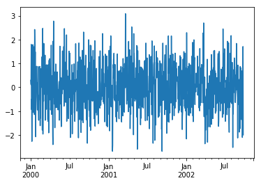

```python
import matplotlib.pyplot as plt
import pandas as pd
import numpy as np
```


```python
time_series = pd.Series(np.random.randn(1000), index=pd.date_range('1/1/2000', periods=1000))
time_series.head()
```


    2000-01-01   -0.601723
    2000-01-02    1.592777
    2000-01-03   -0.279692
    2000-01-04   -1.733784
    2000-01-05   -0.183703
    Freq: D, dtype: float64


```python
time_series.plot()

```


    <matplotlib.axes._subplots.AxesSubplot at 0x114db3860>





```python
dates = pd.date_range('1/1/2010', periods=8)
df = pd.DataFrame(np.random.randn(8, 4), index=dates, columns=['A', 'B', 'C', 'D'])
df.head()
```


<div>
<style scoped>
    .dataframe tbody tr th:only-of-type {
        vertical-align: middle;
    }

    .dataframe tbody tr th {
        vertical-align: top;
    }

    .dataframe thead th {
        text-align: right;
    }
</style>
<table border="1" class="dataframe">
  <thead>
    <tr style="text-align: right;">
      <th></th>
      <th>A</th>
      <th>B</th>
      <th>C</th>
      <th>D</th>
    </tr>
  </thead>
  <tbody>
    <tr>
      <th>2010-01-01</th>
      <td>-0.515721</td>
      <td>-0.445628</td>
      <td>0.462896</td>
      <td>0.053381</td>
    </tr>
    <tr>
      <th>2010-01-02</th>
      <td>1.085268</td>
      <td>0.324155</td>
      <td>0.991156</td>
      <td>-0.016097</td>
    </tr>
    <tr>
      <th>2010-01-03</th>
      <td>0.571827</td>
      <td>-1.400853</td>
      <td>-1.272965</td>
      <td>0.403748</td>
    </tr>
    <tr>
      <th>2010-01-04</th>
      <td>1.093686</td>
      <td>-0.233661</td>
      <td>1.116349</td>
      <td>0.518928</td>
    </tr>
    <tr>
      <th>2010-01-05</th>
      <td>-0.405303</td>
      <td>0.705144</td>
      <td>-0.327468</td>
      <td>-0.730706</td>
    </tr>
  </tbody>
</table>
</div>


```python
df.plot()
```


    <matplotlib.axes._subplots.AxesSubplot at 0x114d40c50>


